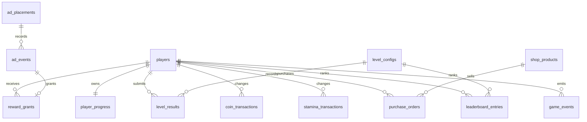

# 数据库设计

本文档面向微信记忆翻牌消除小游戏的 Go 后端、MySQL 存储和 Vue 运营后台。数据库优先支撑第一阶段需要：远程关卡配置、广告频控、玩家进度同步、关卡结果、排行榜、奖励去重和事件上报。

## 设计原则

- 配置数据和玩家行为数据分离，避免运营配置变更影响历史统计。
- 玩家进度、关卡结果、广告事件、奖励发放分别存储，方便排查和统计。
- 客户端可缓存的配置表使用 `version`、`enabled`、`updated_at` 支持增量感知。
- 奖励发放必须通过 `reward_grants.reward_id` 去重，避免广告回调或网络重试导致重复领取。
- 关卡模式使用枚举字段表达：`normal`、`time_limit`、`step_limit`。
- 事件日志使用 JSON 承载扩展字段，但核心筛选字段仍保留结构化列。

## 表关系概览

## 核心表清单

| 表名 | 职责 |
| --- | --- |
| `players` | 玩家账号基础信息，使用微信 `open_id` 作为业务唯一标识 |
| `player_progress` | 玩家当前关卡、金币、体力、提示道具、已通关关卡、星级记录 |
| `level_configs` | 可远程下发的关卡参数，供小游戏和后台共用 |
| `theme_configs` | 主题资源配置，避免关卡直接绑定具体图片路径 |
| `ad_frequency_configs` | 全局广告频控配置 |
| `ad_placements` | 广告位定义，例如提示、双倍奖励、复活 |
| `level_results` | 每局结算结果，支撑留存、难度和排行榜分析 |
| `reward_grants` | 奖励发放流水，使用 `reward_id` 做幂等 |
| `coin_transactions` | 金币增减流水，记录通关、广告、商城消费、后台调整等所有变动 |
| `stamina_transactions` | 体力增减流水，记录金币兑换、自然恢复、消耗、活动赠送等变动 |
| `shop_products` | 商城商品配置，当前可配置金币换体力，后续扩展道具和礼包 |
| `purchase_orders` | 消费订单，记录玩家购买/兑换行为和支付货币 |
| `ad_events` | 广告请求、展示、完成、关闭、失败、奖励发放事件 |
| `leaderboard_entries` | 排行榜成绩，按关卡维度排序 |
| `game_events` | 通用玩法事件日志，用于运营分析 |
| `admin_users` | 后台管理员账号，包含角色、细粒度权限、登录锁定和审计字段 |

## 关键字段说明

### level_configs

关卡配置直接映射客户端 `LevelConfig`：

- `level_id`：业务关卡编号。
- `rows_count` / `cols_count` / `pair_count`：牌阵规模，要求 `rows_count * cols_count = pair_count * 2`。
- `mode`：关卡模式，第一阶段主要使用 `normal`。
- `theme_id`：主题 ID，关联 `theme_configs.theme_id`。
- `initial_preview_ms`：开局正面预览时长。
- `flip_back_delay_ms`：错配后翻回延迟。
- `level_time_limit_seconds`：普通模式时长上限。
- `max_mismatch_count`：错配上限。
- `excellent_step_threshold` / `normal_step_threshold`：3 星和 2 星步数阈值。
- `excellent_time_threshold` / `normal_time_threshold`：时间阈值，可选。
- `coin_reward_star1` / `coin_reward_star2` / `coin_reward_star3`：1 星、2 星、3 星通关金币奖励。

### player_progress

第一版为了减少表复杂度，`level_stars` 和 `completed_levels` 使用 JSON 保存：

- `level_stars` 示例：`{"1":3,"2":2}`
- `completed_levels` 示例：`[1,2,3]`

`coins` 和 `stamina` 是当前余额快照，真实来源以 `coin_transactions`、`stamina_transactions` 和 `purchase_orders` 为准。服务端处理金币换体力时，应在同一个事务内完成：

1. 创建 `purchase_orders`。
2. 写入一条负数 `coin_transactions`。
3. 写入一条正数 `stamina_transactions`。
4. 更新 `player_progress.coins` 和 `player_progress.stamina`。
5. 标记订单为 `paid` 或 `fulfilled`。

如果后续需要按单关查询大量玩家进度，可拆出 `player_level_progress` 表。

### reward_grants

所有奖励都进入统一流水：

- 通关金币：`source = 'level_complete'`
- 广告奖励：`source = 'ad'`
- 每日奖励：`source = 'daily'`
- 活动奖励：`source = 'activity'`
- 商城赠品或兑换结果：`source = 'shop'`

`reward_id` 必须由服务端或客户端生成并全局唯一，重复提交时数据库唯一索引会拦截。

### coin_transactions

金币流水只记录金币余额变化，不承载商品明细：

- `change_amount`：正数表示获得金币，负数表示消耗金币。
- `balance_after`：变动后的金币余额，方便客服和后台审计。
- `reason`：变动原因，例如 `level_complete`、`ad_reward`、`shop_purchase`、`admin_adjust`。
- `ref_type` / `ref_id`：关联来源，例如订单号、奖励 ID、关卡结果 ID。

### stamina_transactions

体力流水记录所有体力变化：

- 进入关卡消耗体力：`change_amount < 0`，`reason = 'level_start'`。
- 金币换体力：`change_amount > 0`，`reason = 'coin_exchange'`，关联 `purchase_orders.order_no`。
- 自然恢复：`reason = 'auto_recover'`。
- 活动赠送：`reason = 'activity'`。

`player_progress.next_stamina_recover_at` 用于自然恢复倒计时。当前规则为未满体力时每 2 分钟恢复 1 点，达到 `max_stamina` 后停止计时；自然恢复由服务端结算，并写入 `stamina_transactions`，客户端只展示倒计时。

### shop_products 与 purchase_orders

`shop_products` 是商品配置，支持后续商城：

- `product_type = 'stamina'`：金币换体力。
- `product_type = 'item'`：购买提示道具等。
- `product_type = 'bundle'`：礼包。

`purchase_orders` 是消费记录：

- `currency_type = 'coins'` 表示金币支付。
- `currency_amount` 表示本次消耗数量。
- `grant_type` / `grant_amount` 表示购买后发放的资源。
- `status` 从 `created` 到 `paid` / `fulfilled` / `cancelled` / `failed`。

### events

`ad_events` 负责广告链路细节；`game_events` 负责更宽泛的玩法行为，例如关卡开始、暂停、重开、新手流失点。两者都保留 `payload JSON`，但不要把常用筛选字段完全塞进 JSON。

## 排行榜排序规则

默认按单关排序：

1. `stars` 降序。
2. `steps` 升序。
3. `elapsed_ms` 升序。
4. `submitted_at` 升序。

如要做全服总榜，可以新增聚合表 `leaderboard_snapshots` 或按离线任务生成排名快照。

## 扩展建议

- `admin_users.password_hash` 使用 bcrypt/argon2 哈希，不保存明文密码；连续登录失败次数与锁定截止时间分别记录在 `failed_login_attempts` 和 `locked_until`。
- 广告位 ID 按环境拆分：测试、体验、正式可放入 `ad_placements.extra_config`。
- 数据量上来后，`game_events` 和 `ad_events` 建议按月归档或分区。
- 若接入微信登录态，`players.session_key_hash` 只保存哈希或短期缓存，不长期保存敏感明文。

完整建表 SQL 见 [schema.sql](schema.sql)。
